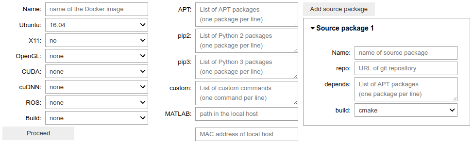

# ROSLab

## *RO*botics *S*oftware with Jupyter*Lab*

ROSLab is a [JupyterLab](https://jupyterlab.readthedocs.io/en/stable/)
environment for a source code repository with robotics software. 
It automatically creates a dockerfile
from the configuration data entered by the user in a simple web form:

## Prerequisites

[Docker](https://www.docker.com/)

[nvidia-docker 2.0](https://github.com/nvidia/nvidia-docker/wiki/Installation-(version-2.0)) For running an image with `OpenGL` and/or `CUDA`.
